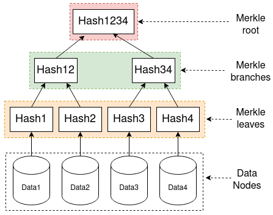
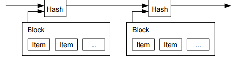

# Blockchain in matadaan

Matadaan is a decentralized voting system, implementing the concept of
blockchain technology, in an Object oriented approach,
built as a semester project, abiding by the guidelines of
[DoECE, Pulchowk Campus](https://doece.pcampus.edu.np).

The concepts of blockchain were used while making the project.
We have fragmented the concept in the following parts to make it easy to understand:

1. [Block](#1-block)

2. [Blockchain](#2-blockchain)

3. [Nodes](#3-nodes)

## Preface:
Before getting into the block and blockchain, an introduction to the components required for them.
### Merkel Root:
A merkel root of a data is calculated to summarize and validate the data. Basically, it acts as a checksum for data. It is calculated by hashing the parts of data, labeled as merkel leaves, then hashing the concatenated merkel leaves to generate merkel branches, and finally hashing the concatenated merkel branches to generate a merkel root, as demonstrated below:

As mentioned above, merkel root acts as a checksum for data validation. A small change in data causes the merkel root to change drastically, due how the hashes work, helps to maintain the validation of data in a block. And the validation of data in a block helps maintaining the proof validation of the block also.

### Timestamp:

A timestamp is a hash of item or collection of item which is different. The data or collection of data in the block should be unique from every other block ,and to make it so, unique characteristics of the block is added as the item in the block like the time of block creation, hash of the previous block.

We compute the hash of the block and publish it publicly, like a newspaper. Including the previously generated hash in the timestamp makes it clear that the previous block must have existed before the creation of the current block which includes the hashes of the previous block. Finally, as more transactions are recorded, more blocks are added, and new hash generated from the current block items and `previously generated hashes`, makes it clear that the previous blocks were there before the creation of new block.

## 1. Block:
A block is a singular component of a blockchain. The combination
of blocks make the blockchain. It consists of different components which
makes it unique from other blocks.

The components used in the block are:

1. Index
2. Current Hash
3. Previous Hash
4. Number-only-used-once (nonce)
5. Data

> Index:

    It is the component of block which is used to track the
    number of blocks present in the chain, and the current index 
    of the block gives a indication of how far is the block from 
    the initial block.

> Current Hash:

    Each block in the blockchain has a unique identity on its own to seperate itself 
    from every other blocks. In a block, it is stored as a hash. Here, referred as blockHash.
    
    It is generated by including the merkel root of Data, Previous Hash, nonce and index.
    A slight change in any of the included above can bring a large change in the hash.

> Previous Hash

    To chain the block, like in linked lists, hash of previous block is used. This helps maintain 
    the unidirectional nature of blockchain and also reinforces the current block and the blocks after it.

> Number-only-used-once(nonce)

    nonce is the key to maintaining the proof-of-work. For our timestamp network, the proof-of-work is
    implemented by incrementing the nonce until a value of nonce is found which satisfies a certain criteria,
    here starting from '00'. So, once the CPU power is exhausted generating the nonce, it acts as a 
    proof-of-work, and the block cannot be changed without redoing the work. And as the blocks are chained
    after it, the work to change the block would exponentially grow due to how the chain is designed to
    contain the previous hash in the current hash(timestamp network).

> Data

    The data in the block is stored as a pair of voter and candidate. The voter id is hashed, to maintain
    the privacy of the voter. A merkel root of the data is generated, which is also included in the 
    block hash. Since a slight change in data would cause the block hash to be changed, it is difficult
    to change the data in the block.

    Since, data is linked with the block hash, and current block hash is linked with the next block hash,
    it will cause avalanche effect on the chain and will require a large pool of CPU power to generate all
    the block hash in the chain, making the data in the block very difficult, nearly impossible, to change the data.

## 2. Blockchain

It is a chain of the block which is discussed above,

1. Blocks
2. [Nodes](#3-nodes)

> Blocks

    Blockchain is a chain of blocks which is interlinked with one another by the means of hashes.
    The previous hash in the Block, makes the chain unidirectional in nature. These hashes and nonce,
    are used to validate the proof of work of the blocks and is also useful while checking if the blocks
    are tampered with.

    A genesis block is created on the creation of the blockchain, which is the first block in the chain.

## 3. Nodes

    Nodes in a blockchain network play a crutial role in maintaing it. Nodes are the different computers,
    in which the blockchain is operating. When a node is getting added in the blockchain network, the 
    blockchain data is shared to the node.

    When a new block is added to the chain, every node collects the block and tries to generate the nonce
    for the proof-of-work.

    Once the nonce is generated which satisfies the pow, it is circulated across all the nodes in the network
    and after validating the pow from the node, it is added to the respective chain of the network.

    If the pow was validated or not in the node is expressed by the node while creating the next block in the
    chain, using the hash of the previous block. 

    Since, this project is just a simple model of the blockchain and requires relatively less computational
    power to mine due to the simple algorithm to generate nonce, the block is mined in the same node in which
    it was created and then the mined block is circulated across the connected node, which is then validated
    and then accepted by other nodes in the blockchain network.
Detailed explanation on how the blockchain network is established in this project is mentioned [here](network.md).

## References:

1. [Bitcoin : A Peer-to-Peer Electronic Cash System (Satoshi Nakamoto)](https://bitcoin.org/bitcoin.pdf)
2. [Blockchain Interfaced Sacure E-Voting System (shrestha et. al)](https://www.researchgate.net/publication/339305141)
    *Article  in  Journal of the Institute of Engineering · February 2020*