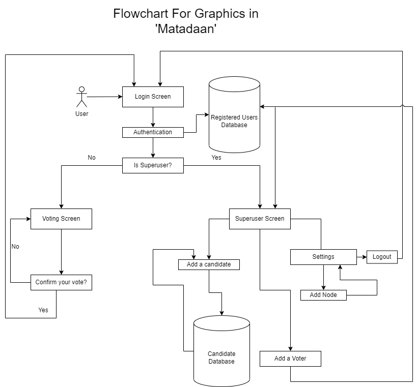

# Graphics In Matadaan
Graphics was one of the major part in our project without which there would have been a certain lack of interactive property. We implemented the graphics in "Matadaan" by using [Gtkmm](http://www.gtkmm.org/en/) library.

The graphics part of our project consists of a initial login screen. and based on the type of user logging in, there are two seperate screens that can be accessed after [login screen](#login-screen) given as: 


   1. [Voting Screen](#voting-screen)     
   2. [Superuser Screen](#superuser-screen)    
     


## Login Screen
The login page is the very first screen that is showed after the ececution of our program. This page allows both the admin and user to login and proceed to the next page. There are two textfields that prompt the user to enter their crediantials . Also there can be seen a button which...  The user after entering his/her login credetials can access the voting screen while the admin in the other hand can access the superuser screen.

Here in login screen, user can see in the screen, two textfields which are created using the 'Entry' widget in gtkmm.Those textfields are added inside of the fixed widget which allows the child widgets to be placed in the user desired place inside the window. The fixed widgetand its child widgets are added inside the constructor of the derived class and are defined from the Gtk namespace in the protected section as shown below:
```cpp
public:
     Hello(){//constructor of class 'Hello'
          add(fixed);//adds the fixed widget
          label1.set_text("Hello");
          fixed.add(label1);//adds the label1 widget inside of fixed
          fixed.move(label1, 240, 120);//moves the label in desired location
          }
protected:
     Gtk::Fixed fixed;//defines the Fixed widget
     Gtk::Label label1;//defines the label widget
```
The voting screen and superscreen are individually described below:

### Voting Screen
This is the screen that loads after the registered user enters his/her secret crediantials in the previous textfields and clicks the login button.

This screen greets the user with the nicely constructed ballot paper like sesigned window consisting of different picturized buttons along with the name of candidates beside them.

The buttons are dynamically arranged in the screen . Here in our project we have created 40 candidates and the buttons were arranged in 8x5 form.

User can then click on their desired candidates party symbol and confirm their vote in order to cast their vote succesfully. After they cast their vote then the login screen automatically reloads for the next user to cast their vote.

   
### Superuser Screen
The superuser screen can be accessed by entering the superuser crediantials in the login screen and clicking the login button.

The superuser screen is designed in our project with the help of special widget called notebook widget in gtkmm. The notebook widget can have the multiple tabs and each tabs can contain the frsme widget within them, those frame widgets in each tabs can be customixed seperately for including the various children widget inside of them. Here we used scrolledwindow, fixed, label, entry and button widget inside the frame widget to design the superuser screen.Threre are multipe tabs inside of superuser screen.

#### Add a voter
The superuser screen has three tabs and first of them is 'Add a voter' tab. This tab has two textboxes and a button which allows the superuser to register a new voter for the election. 

#### Add a candidate
This tab also has two textboxes and a button which allows the superuser to register a new candidate for the election. The second textbox prompts the user to enter the address of election logo of a candidate and after entering the address the respective logo for election is loaded and displayed along with candidate name in the voting screen dynamically.

#### Settings tab
The third and final tab of superuser screen is settings tab. This tab consists of a textbox and a button. The superuser if required can add a new node for the election after entering the node address in the textbox and clicking the add button.

Finally there is also the logout button present in settings tab and its fuction is to allow the superuser to logout from superuser screen that brings the login page again.

