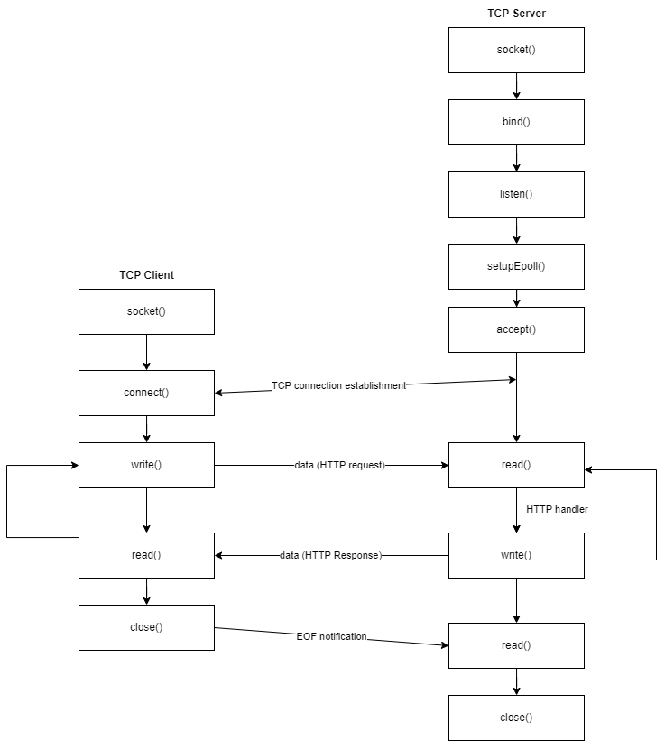

# Networking and Web Socket

A blockchain requires establishment of a peer-to-peer network among the nodes. This is required to
broadcast new transactions to all the nodes, mine the block, validate the block. The nodes makes sure
the blockchain to be secure and majority of nodes accepting the blockchain to be valid makes it valid.

Therefore, a network should be established among the nodes for performing the above mentioned actions.
For this purpose, in this project, a http server based on TCP/IP network protocol is established.

## OSI Model:

The OSI Model (Open Systems Interconnection model) gives a model of system of telecommunication using a
set of protocol suites. The OSI model is divided into 7 layers:
1. Physical Layer
2. Data Link Layer
3. Network Layer
4. Transport Layer
5. Session Layer
6. Presentation Layer
7. Application Layer

In this project, a TCP/IP protocol based transport layer is established on top of which the HTTP based application layer is built.
This helps in the communication of nodes and also helps in publishing the results over the application layer.

### Transport Layer:

The Transport Layer is established using the TCP/IP Protocol. And `sys/socket.h` is used it for its implementation, following the POSIX standard, for unix like systems.

The implementation is explained as below:
#### TCP Server:

For a server, first of all, a socket is created on which a unique address and a port is binded. Here, `AF_INET` address family is binded which refers to IPv4 address and a port is binded on the socket.

After binding the socket with the ip address and port, it starts listening to incoming requests. Since, by default, the listening and working process will be `one thread/process per connection`, and a bunch of connections can take up all the resource on the server,so an epoll has been set up to counter this problem. Setting up an epoll makes a thread is responsible for binding and listening to incoming connections. After a new connection arrives, this thread accepts the connection and sends to one of the pool of threads which will then  be responsible for receiving connections from the listner and process further. This helps maintaining the scalability of the server.

The following processes are done for the server to make and respond to a tcp connection.
* Creating a Socket
* Binding the Socket
* Listening for a connection
* Sending to epoll
* Accepting a connection
* Data Transfer
* Closing the Socket


#### TCP Client:
For a client, a socket is created. Using the socket, it is connected with the server. Then the data transfer happens which is the application layer. After successful data transfer, the socket is finally closed.

* Creating a Socket
* Connecting to the Server
* Data Transfer
* Closing the Socket

#### TCP Connection:



This is how the transport layer is designed over TCP/IP. For the Application layer, Hypertext Transfer Protocol (HTTP) is used.

### Application Layer:

Over the established connection with the TCP/IP, a method of communication should be made avaliable so that the nodes will be able to communicate with each other. Fot that purpose, a HTTP server is setup over the TCP connection established. This HTTP helps in effective
communication of the nodes, and will also help publishing the results over the same network on which the blockchain is established.

#### HTTP:

HTTP is a application-layer protocol. It is a stateless protocol, which follows a classical client-server model. A HTTP connection
is made when a HTTP client sends a HTTP Request to a HTTP Server and HTTP Server sends back the HTTP Response.

The general components of a HTTP Request/Response are:
1. HTTP Header
2. HTTP Request Method
3. HTTP Response Status Codes
4. HTTP Content
5. CSP Directives

These components are chained to form a HTTP Request or a HTTP Response.

A HTTP Request looks like:

```
GET / HTTP/1.1
Content-Type: application/json
Content-Length: 13

{
    "data":3
}
```
In this request, the first line `GET / HTTP/1.1` suggests that a `GET` Request is to be made in the server targeting the URL `/`
with HTTP Version `HTTP 1.1`.
After the first line break, the header portion is started. After a double line break that is after encountering with `\r\n\r\n`,
the HTTP-content portion starts. This HTTP Request is accepted by an HTTP Server, and is processed accordingly. Then a HTTP Response
is sent by the server which looks like:

```
HTTP/1.1 200 OK
Content-Type: application/json
Server: Blockchain Customized HTTP Server
Content-Length: 103

{
    "length": 0
}
```

In this response, the first line, `HTTP/1.1 200 OK` suggests that the HTTP version used is `HTTP 1.1`, and the request made by
the client is okay and is processed successfully is shown from the Response Status Code 200.

After a line break, headers starts and after 2 line breaks that is after the encounter with `\r\n\r\n`, the HTTP content begins.

The HTTP request and responses are transferred from the client to server and back as just normal strings. After the client/server
receives the request message, it is parsed into an Request/Response which is then processed accordingly to generate a meaningful result.

More about HTTP Request and HTTP Responses can be learnt through resources like Mozilla MDN Documentation for HTTP.

In this project, A HTTP Server is established over the nodes which helps maintain blockchain over the node,
share the mined blocks, validate the block which was added and mined in other nodes. This way, the HTTP over
TCP/IP helps maintain the blockchain.

Moreover, the counted votes in the system is made accessible using the HTTP through the nodes.

> REFERENCES:
 * [Oracle Docs For Socket Programming](https://docs.oracle.com/cd/E19620-01/805-4041/6j3r8iu2l/index.html)
 * [Linux Manual Page for Socket](https://man7.org/linux/man-pages/man2/socket.2.html)
 * [Mozilla mdn for HTTP](https://developer.mozilla.org/en-US/docs/Web/HTTP)